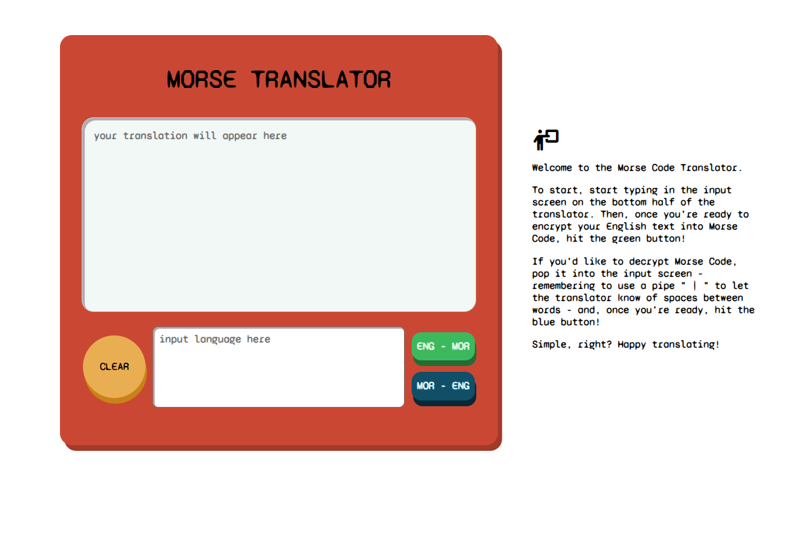

## Project: Morse Code Translator

### Overview

Project: Morse Code Translator aims to create an application that translates between English and Morse Code. For this project, the goal is to create a functional translator that is capable of translating English text into Morse Code with proper formatting (i.e. one space between each character and separation of words represented by a slash (/) or a pipe ( | ) as per the guidelines <a href = "https://morsecode.world/international/translator.html" >here</a>. The aim of this project is to apply learned and accumulated knowledge and further build upon my understanding of JavaScript fundamentals.

### Goals

-   Create a functioning translator that accurately translates between English and Morse Code and vice versa.

## Criteria

-   Create a user interface that allows the user to input English or Morse Code
-   Create JavaScript functions that allows the user to:
    -   translate English to Morse Code
    -   translate Morse Code into English
-   JavaScript functions should also:
    -   handle spaces properly: 1 space between English _words_, but 1 space between Morse Code _characters_
    -   keep pure functions separated from the DOM interaction code

## The to-do list plan

In this section, I break down the project into smaller and manageable tasks to establish metrics to measure my progress on this project. I have also sketched out some ideas to help flesh out the process a little more. This project does not require recreating an image, instead, it affords creative freedom to conjure a design based on my own vision. For this project, I was inspired by an 'Etch a Sketch' and a fun "Gameboy" feel. I sketched some designs (shown below) with some experimental layouts and design elements.

Experimenting lightly with some primary and secondary colours, I aim to create a vibrant and fun application to translate Morse Code and English entries to English and Morse Code respectively.

### HTML & CSS

-   Establish areas for DOM elements
-   User-friendly interface
-   Clear button to reset input text-area
-   Submit/OK/Translate button to translate input text
-   Toggle to switch between the language
-   Written instructions on how to use the Translator

### JavaScript

-   Function to translate text English to Morse Code and vice versa
-   Handles spaces:
    -   1 for each word in English
    -   1 for each character in Morse Code
        -   / or | as space between words
-   Toggle function to switch between language input
    -   English to Morse Code
    -   Morse Code to English
-   Function to reset the entire display both input and display
-   Function to clear the input

### Still to do: 
- Fix horizontal overflow for mobile display 

### Extras

-   Add numbers and punctuation into the Morse Code/Eng directory
-   Alert to notify the user if user is trying to translate an empty input

### Extras that _actually_ extras

-   Animated typing for the translated text
-   QWERTY keyboard input on the screen to further add to the "toy" appearance

## The APP

### Running the program
Open terminal, go to desired location and clone the repo
`git clone git@github.com:edlyn-e/morse-translator.git` 

Open up index.html in Visual Studio code and hit 'Go Live'

The morse translator now works on your machine
